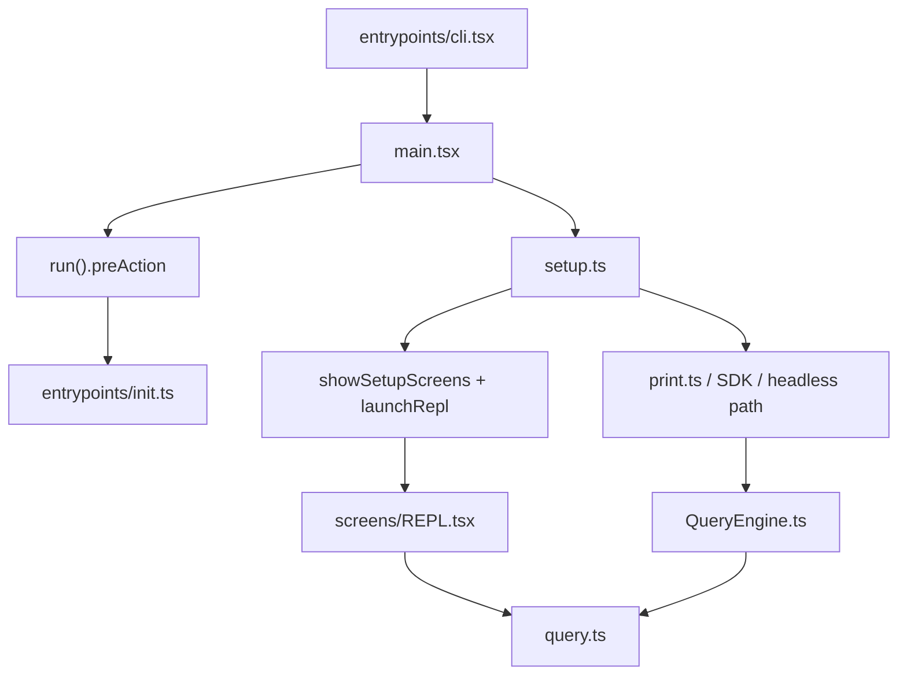

# 运行时与入口

## 覆盖模块

- `src-root`
- `entrypoints`
- `cli`
- `bootstrap`
- `state`
- `screens`
- `query`
- `migrations`
- `assistant`

## 总体判断

这一层不是普通的 CLI 启动层，而是“进程级路由器 + 会话级引擎装配层”。

如果只按目录名理解，很容易误以为：

- `entrypoints/` 只是入口
- `main.tsx` 只是启动文件
- `setup.ts` 只是初始化脚本
- `screens/REPL.tsx` 只是某个界面

实际并不是。真正的主干是：

## 根级运行时拼接层

根级文件并不零散，它们是不同控制面的装配节点：

- `main.tsx`：进程级总控、模式分流、入口参数重写、默认命令动作
- `query.ts`：一轮 agent 执行状态机
- `QueryEngine.ts`：headless/SDK 会话封装
- `commands.ts`：用户控制面注册表
- `tools.ts`：模型控制面注册表
- `Tool.ts`：工具协议
- `setup.ts`：会话与工作区预热、后台注册、prefetch

这层的共同特征是：它们都不是单一业务模块，而是在给整棵运行时树搭骨架。

## `entrypoints/cli.tsx`

`entrypoints/cli.tsx` 的真实角色是 fast-path 路由器，不是单纯“调用 `main()`”。

它在导入 `main.tsx` 之前就做了几类决定：

- 先改写环境变量和若干进程级开关
- 处理一批完全不需要完整应用壳的快速路径
- 只在默认路径上开始 early input capture
- 最后才进入 `main.tsx`

这意味着它并不是“最薄的入口”，而是整个程序的第一层分流器。

## `main.tsx`

`main.tsx` 是第一个超大总控文件。

它同时承担：

- 模块求值阶段的启动副作用
- CLI 参数重写
- interactive / headless / remote / direct connect / ssh 等路径选择
- preAction 初始化屏障
- 默认命令动作
- setup、trust、REPL、print/headless 的最终分岔

最反常的一点是：这个文件的一部分启动性能优化发生在“模块求值期”，而不是在显式函数调用里。

### 模块求值期副作用

导入 `main.tsx` 时就会发生：

- startup profiler checkpoint
- MDM 原始读取预热
- keychain 预取
- 若干 feature-gated `require()`

这不是 incidental complexity，而是故意利用“导入期间并行化”来隐藏启动延迟。

## `entrypoints/init.ts`

`init.ts` 不是“一个 helper”，而是启动期的正式屏障。

它的顺序大致是：

1. 启用配置系统
2. 先应用 safe env vars 与 CA certs
3. 安装 graceful shutdown
4. 异步预热 1P logging / OAuth / IDE detection / repo detection
5. 建立 remote managed settings / policy limits 的 loading promise
6. 配置 mTLS / proxy / global agents
7. 预连 Anthropic API
8. 远端模式下按需初始化 upstream proxy
9. 注册清理逻辑
10. 如果启用 scratchpad，则创建目录

这里最值得记住的是：它把“信任前能做什么、信任后能做什么”分得很细。

## `setup.ts`

`setup.ts` 是会话级预热层，不是单纯的一次性 init。

它负责：

- session id / cwd / projectRoot 切换
- UDS inbox 与 teammate snapshot
- 终端备份恢复
- hooks snapshot 与文件变更 watcher
- worktree / tmux 创建与切换
- background jobs / plugins / hooks / session memory 预热
- 发出 `tengu_started`
- 若干 release note / api key / bypass-permission 相关检查

换句话说，`init.ts` 偏进程级，`setup.ts` 偏会话级。

## `bootstrap/state.ts` 与 `state/*`

这两个状态层同时存在，说明这份代码在维护两类不同状态：

- `bootstrap/state.ts`：进程级 latch 和启动态单例
- `state/*`：前台会话态与 UI/REPL 运行态

这不是重复设计，而是刻意拆开的两层状态平面。

## `migrations`

`migrations/` 体量不大，但非常说明问题：

- 默认模型在迁移
- 权限设置在迁移
- remote control / MCP / updater 行为在迁移

这不是按“一次性开源工程”写出来的结构，而是按长期迭代产品写出来的。

## 第二轮补充研究：启动精确调用图

### 1. 真正的启动顺序

1. `entrypoints/cli.tsx` 在模块顶层先做 env mutation 和 fast-path 判断。
2. 只有默认路径才开始 early input capture，并导入 `main.tsx`。
3. 导入 `main.tsx` 时，startup profiler、MDM 预热、keychain 预热已经开始。
4. `main()` 再做 Windows PATH 硬化、信号处理、argv 重写、interactive/headless 判定、entrypoint/client type 设置、settings flag 预载入。
5. `run().preAction` 才是真正的初始化屏障：等待 MDM/keychain、执行 `init()`、挂 sinks、跑 migrations、准备 remote settings/policy limits。
6. 默认 action 中又会装配权限模式、MCP 初态、bundled skills/plugins，并行跑 `setup()` 与 command/agent discovery。
7. 最后才分为：
   - interactive：trust/setup screen -> `launchRepl()`
   - headless：full env + telemetry + MCP connect + `print.ts`

### 2. 顶层副作用并不是偶然

最值得记住的反常点：

- `cli.tsx` 在导入主程序前就改环境变量
- `main.tsx` 在模块求值期就启动子任务
- `init.ts` 依赖大量进程级单例状态

这说明这份代码把“导入顺序”本身当成了启动协议的一部分。

### 3. feature gate 不是普通开关

这一层的 `feature(...)` 不只是运行时布尔判断，而是在参与：

- build-time 裁剪
- import 路径选择
- 不同 entrypoint 的形状分化
- 内外部版本差异保留

所以入口层的实际结构，必须结合 feature gate 才能看懂。

## 这一层最反常的地方

1. `entrypoints/cli.tsx` 是 fast-path 路由器，不是薄入口。
2. `main.tsx` 把大量正确性建立在模块求值顺序上。
3. `init.ts` 与 `setup.ts` 分别维护进程级和会话级初始化，两者都很重。
4. interactive 与 headless 并不是小分支，而是两条正式产品路径。
5. `QueryEngine.ts` 虽然出现了，但运行时主干仍然没有完全从 REPL 剥离出来。
