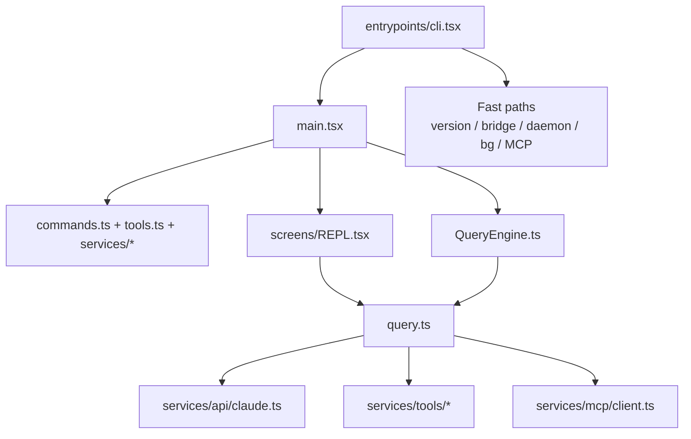

# 运行时与入口

## 覆盖模块

- `src-root`
- `entrypoints`
- `cli`
- `bootstrap`
- `state`
- `screens`
- `query`
- `migrations`
- `assistant`

## 总体判断

Claude Code 的入口层不是普通 CLI 启动器，而是一套“快路径路由器 + 进程级总控 + 会话引擎 + 前台 REPL 壳”。

如果只看目录名，很容易误以为 `entrypoints/`、`cli/`、`screens/`、`state/` 各管一层；实际上真正的运行时主链路是：

最关键的事实是：

- 很多路径根本不会进入完整 REPL。
- `main.tsx` 本身就是产品级总控单体。
- `query.ts`/`QueryEngine.ts` 才是“一轮 agent 执行”的核心。

## `src-root`

根目录下那批孤立文件，其实不是零碎文件，而是运行时拼接面：

- `main.tsx`
- `commands.ts`
- `tools.ts`
- `query.ts`
- `QueryEngine.ts`
- `setup.ts`
- `Task.ts`
- `Tool.ts`
- `context.ts`
- `history.ts`

它们共同特征是：不属于单一业务域，而是负责把多个大模块缝合到一起。

### 这层最值得注意的点

- `main.tsx` 是启动和模式分流中枢。
- `commands.ts` 和 `tools.ts` 分别是用户控制面和模型执行面的注册总线。
- `query.ts` 和 `QueryEngine.ts` 不是重复，而是“交互式主循环”和“可复用 headless 会话引擎”的分层。
- `Tool.ts`/`Task.ts` 是运行时协议文件，整个系统的很多复杂度都从这里向外扩散。

## `entrypoints`

### 模块定位

`entrypoints/` 不是简单 `main()` 包装层，而是冷启动期的特殊入口集合：

- `cli.tsx`
- `init.ts`
- `mcp.ts`
- `sandboxTypes.ts`
- `agentSdkTypes.ts`
- `sdk/*`

### `entrypoints/cli.tsx`

这是整个仓库最重要的入口文件之一。它的角色不是“启动 REPL”，而是“先把不需要完整应用壳的路径都短路掉”。

典型 fast path 包括：

- `--version`
- dump system prompt
- Claude in Chrome MCP
- computer-use MCP
- daemon worker
- bridge / remote-control
- background sessions
- template jobs
- environment runner / self-hosted runner
- tmux + worktree 预处理

这说明 Claude Code 不是单一命令行程序，而是多个运行模式共用一份入口路由器。

### `entrypoints/init.ts`

`init.ts` 更像启动总线：

- 环境变量处理
- 配置加载
- telemetry/growthbook 初始化
- 远程与 proxy 预热
- session/trust 相关初始化

它的重要性在于：很多 feature gate、远程路径和安全路径都需要在真正进入 REPL 前就完成。

## `cli`

`src/cli/` 体量不大，但职责很“底层”：

- print/structured IO
- transports
- auth/agents/mcp/auto-mode handlers

这层说明 Claude Code 不只有 TUI 输出，还有：

- headless print 模式
- SDK/NDJSON/structured output
- websocket/SSE 传输

也就是说，`cli/` 更像“进程边界适配层”，而不是命令实现层。

## `bootstrap`

`src/bootstrap/state.ts` 文件数只有 1，但地位极高。

它维护的是进程级全局单例状态，例如：

- session id
- cwd/project root/original cwd
- interactive/non-interactive 标志
- client/session source
- SDK betas
- 远程模式标志
- 一些 classifier / transcript / telemetry 相关 latch

这层很像“启动期全局状态寄存器”。它的存在说明：这个仓库并没有把全部状态都塞进 React store，很多状态在更靠近进程入口的地方就被固定住了。

## `state`

`state/` 不是 Redux，而是自定义 store：

- `AppStateStore.ts`
- `AppState.tsx`
- `store.ts`
- `selectors.ts`

### 特征

- 用 `useSyncExternalStore` 订阅切片，避免大面积重渲染。
- `AppState` 里混的不只是 UI 状态，而是运行时内核状态：
  - tasks
  - bridge
  - remote
  - plugins
  - mcp
  - toolPermissionContext
  - replContext
  - computerUse/browser panel 等产品态

### 结论

这不是“界面状态树”，而是“前台会话运行态树”。

## `screens`

只有三个主屏：

- `REPL.tsx`
- `Doctor.tsx`
- `ResumeConversation.tsx`

这件事非常能说明问题：前台交互几乎都被吸进一个巨型会话壳里，而不是分成很多页面。

### `REPL.tsx`

`REPL.tsx` 是第二个超大总控文件。它负责：

- 消息流与 transcript
- query 循环
- 权限请求 UI
- 任务导航与详情弹窗
- 远程会话与 bridge
- IDE/voice/plugin/browser panel
- global search / survey / notifications

它不像“某个 screen 组件”，更像一个终端前台应用内核。

## `query`

`src/query/` 加上根级 `query.ts` / `QueryEngine.ts` 构成了真正的执行核心。

### `query.ts`

负责：

- 发起模型请求
- 处理流式 assistant blocks
- 执行 tool use
- stop hooks
- compaction
- token budget
- tool summaries
- 递归进入下一轮

这层最像状态机，而不是“调用一次 API”。

### `QueryEngine.ts`

这是把 query 生命周期从 REPL 中抽成可复用引擎的结果：

- 支持 SDK/headless 会话
- 持久化 messages / read file state / usage
- 处理 replay user messages
- 统一 structured output / permission denial / budget 错误

最值得记住的点是：交互式路径和 headless 路径已经开始共用引擎，但并没有完全剥离。仓库处在“引擎化进行到一半”的状态。

## `migrations`

`migrations/` 很小，但意义明确：Claude Code 不是静态工具，而是长期演化产品。

迁移内容集中在：

- 模型默认值变更
- 自动更新设置
- bypass permissions/settings 重写
- MCP 设置迁移
- remote control 默认项迁移

这层暴露了产品历史：模型名、默认策略、权限形态都在持续变化。

## `assistant`

`assistant/` 目录本身非常薄，当前恢复代码里最显眼的是 `sessionHistory.ts`。

### 反常点

- 目录很小，但 “assistant / kairos mode” 却散在全局：
  - `main.tsx`
  - `REPL.tsx`
  - `bridge/`
  - `remote/`
  - `tools/BriefTool`
  - feature gates

### 结论

`assistant` 不是一个封闭 bounded context，而更像一个横切模式开关。

## 这一层最反常的地方

1. `entrypoints/cli.tsx` 是快路径路由器，不是普通 CLI 入口。
2. `main.tsx` 和 `REPL.tsx` 形成“双巨石内核”。
3. `QueryEngine.ts` 说明团队在把交互式 agent loop 抽成可复用引擎，但抽离尚未彻底完成。
4. `bootstrap/state.ts` 和 `state/AppStateStore.ts` 并存，说明这套系统同时维护“进程级状态”和“前台应用状态”。
5. `migrations/` 的存在提醒我们：这份代码不是按一次性开源项目的标准写的，而是按持续迭代产品写的。
