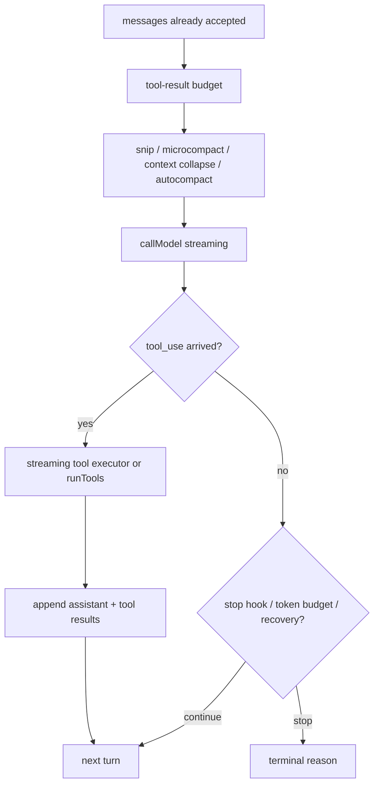

# 命令、工具与任务面

## 覆盖模块

- `commands`
- `tools`
- `tasks`
- `coordinator`

## 总体判断

这一层是 Claude Code 的执行控制面。

最重要的判断是：这里并不存在单一控制接口，而是两套并行控制面同时存在：

- `commands`：用户通过 slash command 驱动系统
- `tools`：模型通过 tool use 驱动系统

`tasks` 则是两者共用的执行平面，承载本地 shell、子 agent、remote agent、teammate 等不同任务模型。

## `commands`

`commands` 系统不是“命令列表”，而是用户控制面的能力注册表。

它至少有三类形态：

- `prompt`
- `local`
- `local-jsx`

也就是说，slash command 可以是 prompt 宏、可以是本地逻辑、也可以直接挂 UI。

`commands.ts` 做的事情不是导出数组，而是合并：

- built-in commands
- bundled skills
- user skills
- plugin commands
- workflow commands
- MCP skill commands

然后再按运行时模式做裁剪：

- remote mode
- bridge mode
- auth / provider / feature gate

## `tools`

`Tool.ts` 定义的不是轻量接口，而是正式协议对象。

它要求工具不仅声明：

- schema
- call

还要声明或影响：

- permission
- concurrency / read-only 语义
- interrupt behavior
- 进度消息
- 结果映射
- UI 渲染
- context modifier
- MCP 元信息

所以工具在这份代码里是一等运行时实体，不是简单的函数。

## `tasks`

`tasks` 不是实现细节，而是正式的多执行器任务平面。

当前能看到的层级包括：

- 本地 shell 任务
- 本地子 agent 任务
- 远端 agent 任务
- 同进程 teammate 任务

这说明团队没有把“agent”收敛成单一执行器，而是把不同隔离级别与宿主环境都产品化了。

## `coordinator`

`coordinator/coordinatorMode.ts` 是非常反常的文件。

它不是普通 helper，而是直接把下面这些东西写进源码：

- coordinator 的 system prompt
- worker 能力边界
- 恢复 / 继续 / 终止 worker 的规则
- scratchpad 与任务工作流提示

这说明“多 worker 编排”不是临时实验，而是正式模式。

## 第二轮补充研究：`query.ts` 是真正的 turn 状态机

`query.ts` 不应该被理解成“调一次 API”。它是带多条续跑路径的状态机。

### 1. preflight

每轮迭代一开始会做：

- 从 compact boundary 之后切历史
- 应用 tool result budget replacement
- history snip
- microcompact
- context collapse
- proactive autocompact

这个顺序很关键，因为它决定了哪些恢复机制还能接手，哪些已经被前置裁剪掉了。

### 2. API stream

真正的模型请求是在：

- 拼上 `prependUserContext(...)`
- 拼上 system prompt
- 带上 task budget
- 然后进入 `deps.callModel(...)`

流式过程中会累计：

- assistant blocks
- `tool_use` blocks
- recoverable API errors

而 `tool_use` 的到达会把 turn 从“采样”切到“需要 follow-up”的状态。

### 3. tool execution 有两种模式

#### 流式模式

如果 `StreamingToolExecutor` 开启：

- 工具在 streaming 时就开始执行
- progress 会立刻回流 UI/transcript
- 最终结果按接收顺序缓冲与发射
- 遇到 sibling bash error、user interrupt、streaming fallback，会生成 synthetic `tool_result`

它的核心价值不是“更快”，而是把“模型继续流式输出”和“工具开始执行”重叠起来。

#### 非流式模式

如果不开启流式工具执行：

- 等整轮 assistant stream 结束
- 再调用 `runTools(...)`
- concurrency-safe 工具并发跑
- 非并发安全工具串行跑

### 4. continuation paths

这份文件最复杂的地方不是错误处理，而是 continuation。

主要续跑路径有：

- normal next turn
- proactive autocompact
- context-collapse overflow recovery
- reactive compact
- max-output-tokens recovery
- stop-hook retry
- token-budget continuation

这解释了为什么它看起来不像普通 request loop，而像业务状态机。

### 5. termination paths

终止也不是单一出口，而是多类：

- pre-API blocking limit
- stream / runtime failure
- recovery exhausted 后的 surfaced error
- stop hook 阻断
- post-tool abort
- `maxTurns` 达上限

## 第二轮补充研究：工具生命周期

### 1. registry

`Tool.ts` 负责定义工具协议，`buildTool()` 给出安全默认值：

- 默认权限 passthrough
- fail-closed 的 concurrency / read-only 默认语义
- 统一的 result / UI / metadata 约定

### 2. registry assembly

`tools.ts` 维护 built-in source of truth：

- `getAllBaseTools()`
- `getTools()`
- `assembleToolPool()`

它会叠加：

- simple mode
- REPL mode 隐藏 primitive tools
- deny-rule 过滤
- MCP tools 合池与重名去重

### 3. permission decision path

主路径是：

1. `runToolUse()`
2. `checkPermissionsAndCallTool()`
3. schema / `validateInput`
4. pre-tool hooks
5. `resolveHookPermissionDecision(...canUseTool...)`
6. 真正 `tool.call(...)`

所以权限不是外围逻辑，而是工具调用协议的一部分。

### 4. `useCanUseTool()`

`useCanUseTool()` 不是一个简单布尔判断 hook。

它会：

- 创建 `PermissionContext`
- 调用 `hasPermissionsToUseTool()`
- 对 `allow` 直通
- 对 `deny` 记录与上报
- 对 `ask` 分流到：
  - coordinator worker 自动化判定
  - swarm worker 转发
  - Bash classifier 快速路径
  - interactive permission UI queue

这说明权限 UI、自动分类器、swarm 协议都在这里汇合。

### 5. orchestration

`toolOrchestration.runTools()` 和 `StreamingToolExecutor` 是两套不同 orchestration：

- `runTools()`：流式结束后的 batch 编排
- `StreamingToolExecutor`：流式过程中的即时编排

二者都需要保证：

- 并发安全工具能并行
- 非并发安全工具串行
- transcript 顺序稳定
- `contextModifier` 应用时机正确

### 6. transcript / UI writes

工具执行产物不会直接裸写 transcript，而是先标准化：

- progress -> `createProgressMessage`
- success / deny / error -> `createUserMessage(tool_result)`
- hooks / structured payload -> `createAttachmentMessage`
- 最终经过 `processPreMappedToolResultBlock()` / `processToolResultBlock()`

所以 transcript 也是工具协议的一部分，而不是后处理。

### 7. task / background semantics

`ToolUseContext` 里显式带着：

- `setAppStateForTasks`
- `agentId`
- denial tracking
- prompt-avoidance
- transcript-preservation

这意味着同一条工具管线既服务主线程，也服务背景 agent，只是 transcript 噪声级别和保留策略不同。

## 这一层最反常的地方

1. `commands` 和 `tools` 是并行控制面，不是上下层。
2. `query.ts` 是续跑状态机，不是普通 API loop。
3. `Tool.ts` 比命令协议还重，已经接近平台接口。
4. 工具执行链天然带权限、hooks、telemetry、transcript 语义。
5. `tasks` 说明系统从一开始就打算支持多执行器和多隔离级别。
